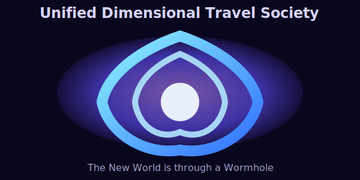

# UnifiedDimensionalTravelSociety

The New World is through a Wormhole

## About the Universe
Unified Dimensional Travel Society is a fictional organization built around exploration of new worlds through wormholes. This project captures the lore, the portal graphic, and the README content discussed with Copilot.

## Included Files
- `README.md` — the project landing page and universe summary
- `UNIVERSE.md` — a companion document describing the fictional setting and assets
- `assets/wormhole.svg` — the wormhole portal illustration

## Viewing the Project
Open `README.md` on GitHub or in a markdown preview to see the embedded wormhole graphic. The SVG is located under `assets/wormhole.svg` and can be opened directly in a browser or vector editor.
